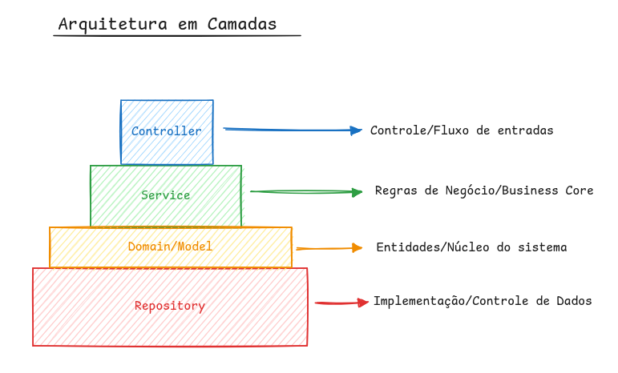
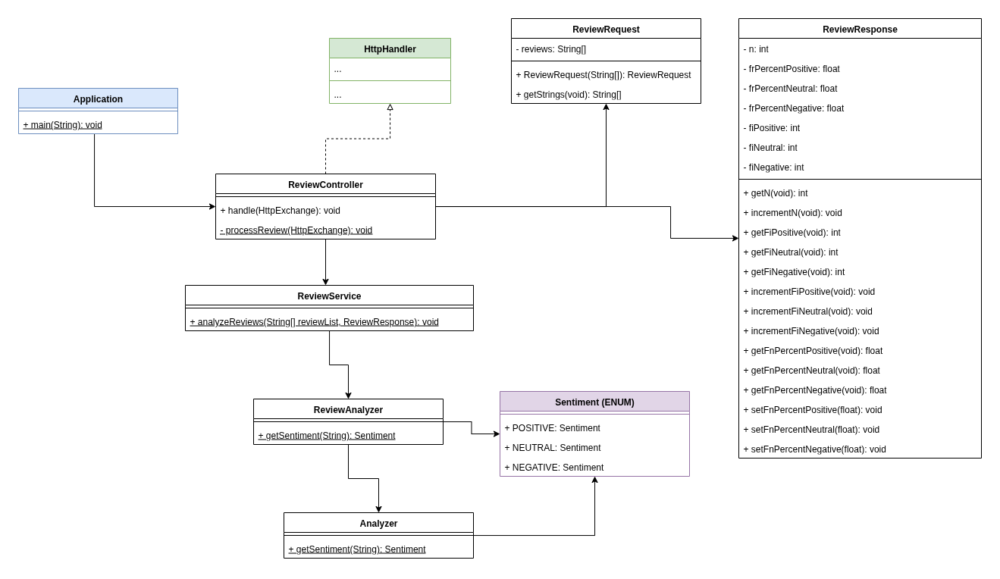

# ✉️ Review Analizer
#### Projeto acadêmico - Engenharia de Software

## 1. Sobre

BackEnd(Web API) de projeto que analiza textos utilizando NLP (Natural Language Process) do ChatGPT, desenvolvido na disciplina de Ciência de Dados e análise Estatística durante o curso de Engenharia de Sofware.


## 2. Tecnologias utilizadas

- Java 17
- Git
- Apache Maven (Gerenciamento de projeto)
- Java HttpServer Client
- API Chat GPT
- Postman (Teste de API)
- RailWay (deploy)
- Intellij Community IDEA
- Padrão REST API
- Padrão SOLID

## 3. Como utilizar 
### Request
- Endpoint: ```https://reviewanalyzer.up.railway.app/process```
- Método: ```POST```
- Header: ```{Content-Type: application/json}```
- Body: JSON str Array
  
  exemplo:
  ```
  ["gostei do produto", "não gostei do produto"]
  ```

### Response
```
{
  "n": <int>,
  "frPercentPositive": <float>,
  "frPercentNeutral": <float>,
  "frPercentNegative": <float>,
  "fiPositive": <int>,
  "fiNeutral": <int>,
  "fiNegative": <int>
}
```

- **n:** Tamanho da amostra;
- **frPercent\<D\>:** Frequência relativa do dado D;
- **fi\<D\>:** Frequência absoluta do dado D;

  
## 4. Arquitetura




